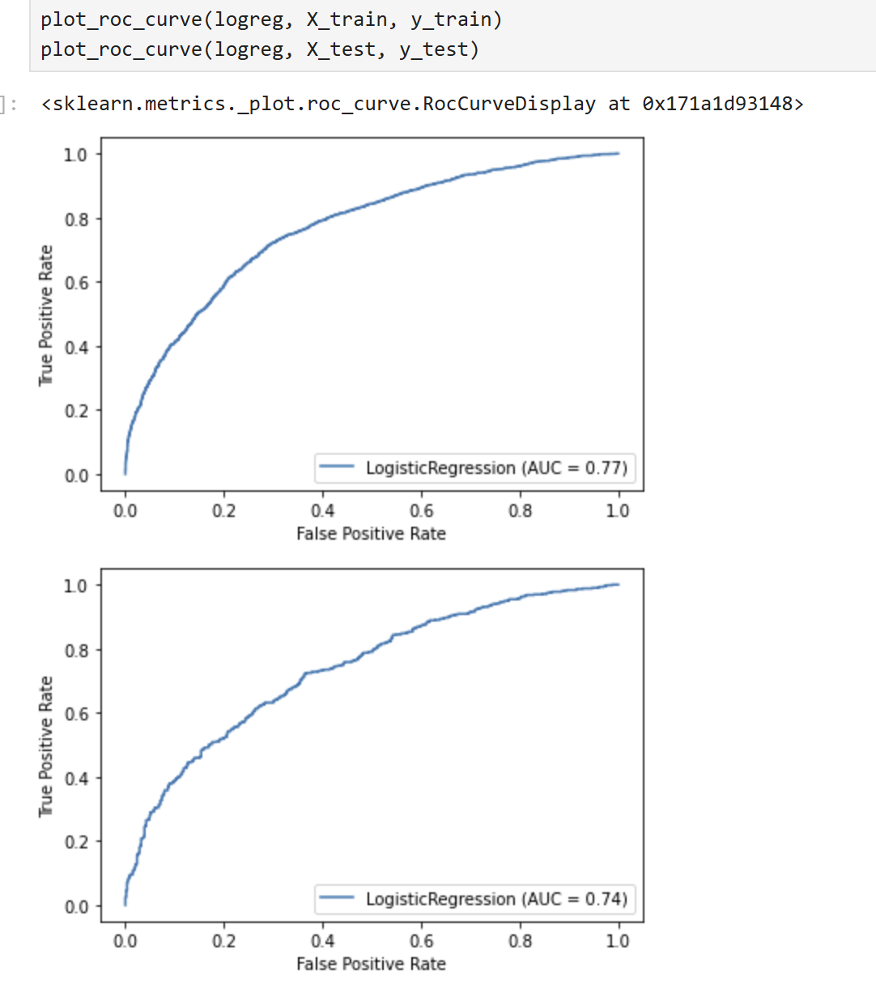
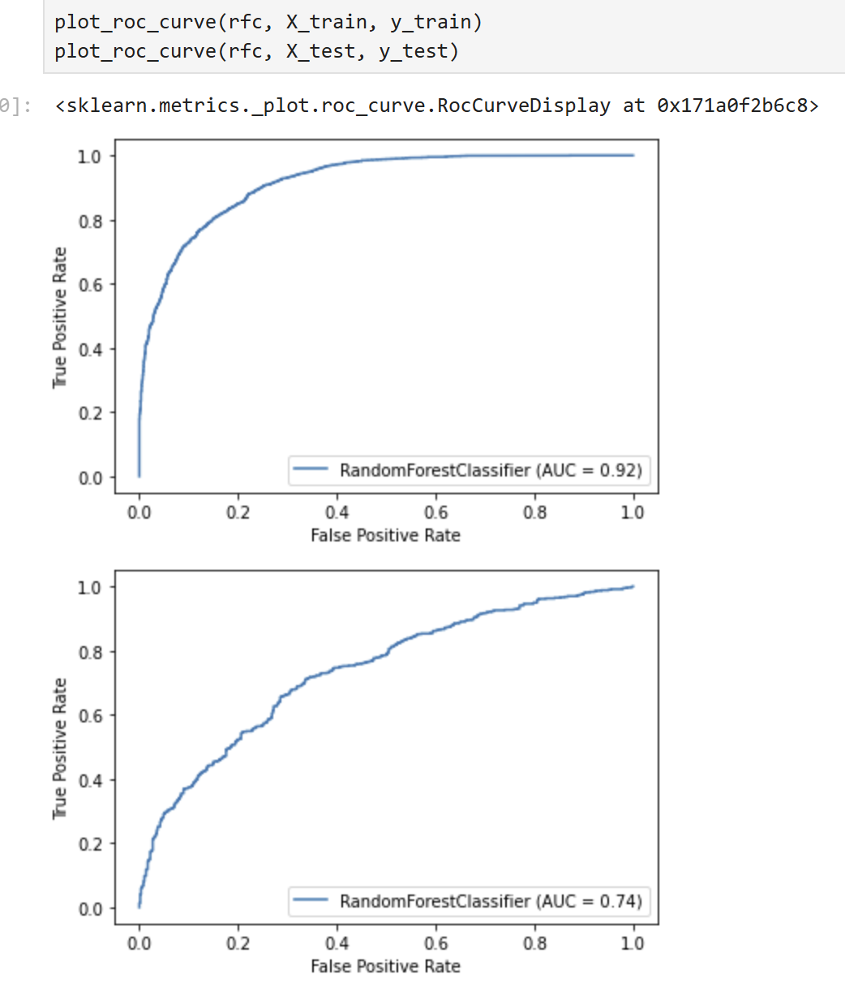
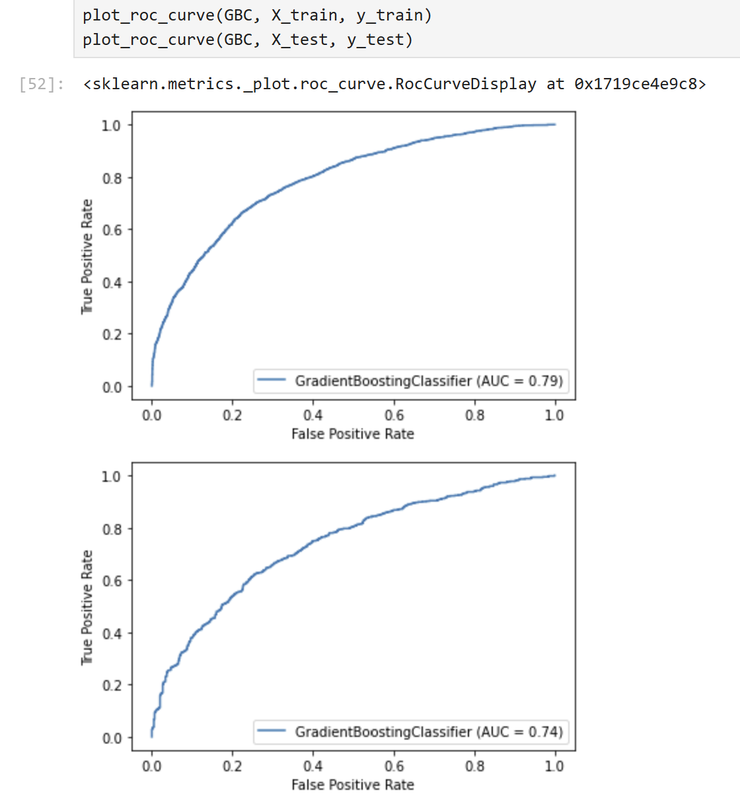

# Classification of Elite and sub elite Goalkeepers from professional football using multiple machine learning models (Internship Project)

## Overview
Implemented a machine learning pipeline to classify elite vs. sub-elite goalkeepers using Opta football data. Compared Logistic Regression, Random Forest, and Gradient Boosting models, achieving ~67% accuracy and 0.72 ROC-AUC. Project demonstrates end-to-end ML skills: preprocessing, feature selection (RFE), cross-validation, model evaluation, and feature interpretability — with insights highlighting the importance of distribution and passing skills in modern elite goalkeepers.
* Built ML models to classify elite vs. sub-elite goalkeepers in top European leagues.
* Elite GK = UEFA Champions League appearance (proxy for top-tier status).
* Based on real-world Opta Sports performance data (14,671 match observations).

## Question 
Which performance attributes best distinguish elite from sub-elite professional football goalkeepers, and can machine learning models reliably classify them based on match performance data?

## Dataset

* 5 seasons (2013/14–2017/18), 353 goalkeepers.
* 73 performance KPIs (passing, distribution, saves, etc.).
* Balanced dataset (~5,918 samples) using under-sampling.
* Data preprocessed: irrelevant features removed, Min–Max scaling applied.

## Libraries & Tools

* Data handling & preprocessing: pandas, numpy
* Machine learning & feature selection: scikit-learn (Logistic Regression, Random Forest, Gradient Boosting, RFE, GridSearchCV, train/test split)
* Visualization: matplotlib, seaborn (confusion matrices, ROC curves, feature importance plots)
* Environment: Jupyter Notebook, Python 3.x

## Methodology
A structured ML pipeline to preprocess the data, train multiple models, and evaluate their performance
* Feature selection: Recursive Feature Elimination (RFE).
* Models used: Logistic Regression, Random Forest, Gradient Boosting.
* Model tuning: Grid search + 5-fold cross-validation.
* Evaluation metrics: Accuracy, F1-Score, ROC-AUC.
* Interpretability: LR coefficients + feature importance (RF & GBC).

## Results

* Test accuracy: ~66–67% (similar across all models).
* ROC-AUC: ~0.72, F1 ≈ 0.65.

### Common features across models (n=15).

* Elite indicators: short distribution, passes received, successful forward passes, clean sheets.
* Sub-elite indicators: long distribution, unsuccessful opposition-half passes, more goals conceded.

## ROC curves

Logistic Regression

Random Forest

Gradient Boosting

## Insights

* End-to-end ML pipeline: preprocessing → feature selection → training → evaluation → interpretation.
* Multi-model approach: robustness via LR, RF, GBC comparison.
* Insight: Elite GKs stand out more by distribution and footwork skills than by shot-stopping.
* Sports analytics impact: Data-driven talent identification for recruitment & coaching.
* Combines academic rigor + applied ML implementation in Jupyter Notebook with figures & results.
